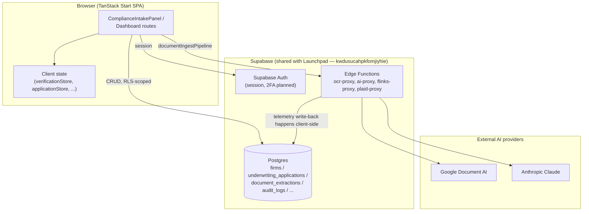
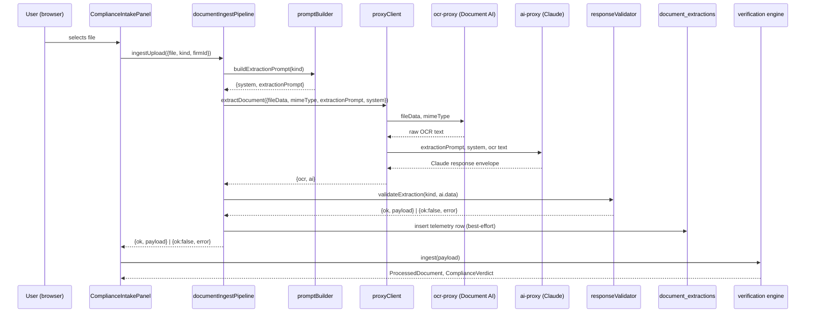

# BrokerMindAI — System Architecture

This document describes the production architecture of the BrokerMindAI underwriting workspace, with a focus on the AI document ingestion pipeline introduced in Phase 1. See `docs/ROADMAP.md` for what's shipped versus planned.

## 1. Overall system architecture



This app and the Launchpad marketing/waitlist site are **separate git repos and separate Vercel projects**, but **share one Supabase project** (`kwdusucahpkfomjiyhie`). Schema changes here are shared infrastructure.

Data model is organized around **firms** (`firms` / `firm_members` / `is_firm_member(firm_id)`), this app's existing workspace/organization concept — every table that should be workspace-scoped (applications, documents, audit logs, and now extraction telemetry) carries a `firm_id`.

## 2. AI document ingestion pipeline

```
Upload (PDF / JPG / JPEG / PNG / HEIC / HEIF / TIFF / WebP, or a .json test file)
   │
   ▼
ComplianceIntakePanel.onFile()
   │  (thin — delegates entirely to the pipeline)
   ▼
documentIngestPipeline.ingestUpload()
   │
   ├─ isJsonFile? ──yes──► ingestFromJson()  [TEMPORARY, see §5]
   │                          reads the file as JSON verbatim, no OCR/Claude
   │
   └─ no ──► ingestFromDocument()
                 │
                 ├─ validate MIME type against DocumentIngestionDefinition.upload
                 ├─ buildExtractionPrompt(kind)      [documentDefinitions/promptBuilder.ts]
                 ├─ proxyClient.extractDocument()    [UNCHANGED]
                 │     ├─ ocr-proxy  → Google Document AI  (raw OCR text)
                 │     └─ ai-proxy   → Claude               (structured extraction)
                 ├─ validateExtraction(kind, response) [documentDefinitions/responseValidator.ts]
                 │     unwraps Claude's envelope, strips markdown fences,
                 │     JSON.parse, allowlists keys against
                 │     DocumentRegistry[kind].fields[].name
                 └─ recordExtraction()  → document_extractions (telemetry, best-effort)
   │
   ▼
ingest(payload)   [ComplianceIntakePanel.tsx — UNCHANGED]
   │
   ▼
processDocument() → aggregateCompliance()   [documentRegistry.ts — UNCHANGED]
   │
   ▼
verificationStore.addDoc()                  [UNCHANGED]
   │
   ▼
DocumentVerificationModal / DossierGate / ComplianceAlertBanner / ...  [ALL UNCHANGED]
```

**The verification engine has zero knowledge that OCR or Claude exist.** Its only contract with the pipeline is the plain `Record<string, unknown>` payload `ingest()` receives — the same shape whether it came from manual form entry, a JSON test file, or a real scanned document.

### Files

| File | Role |
|---|---|
| `src/lib/documentIngestPipeline.ts` | Owns the entire flow: type detection, base64 conversion, prompt building, calling `proxyClient`, response validation, telemetry. |
| `src/documentDefinitions/types.ts` | `DocumentIngestionDefinition` type — upload/OCR/Claude config only. |
| `src/documentDefinitions/registry.ts` | `getIngestionDefinition(kind)` — per-kind overrides with sensible defaults, so any `DocumentKind` already in `documentRegistry.ts` works without a new entry here. |
| `src/documentDefinitions/promptBuilder.ts` | Generates Claude's system prompt + extraction instruction from `DocumentRegistry[kind].fields` — no hand-written per-document prompt text anywhere. |
| `src/documentDefinitions/responseValidator.ts` | Unwraps/cleans/validates Claude's response, aligning field names exactly with `DocumentRegistry[kind].fields[].name`. |
| `src/lib/proxyClient.ts` | **Unchanged.** `ocrProxy`, `aiProxy`, `extractDocument`. |
| `supabase/functions/ocr-proxy`, `ai-proxy` | **Unchanged.** Real Google Document AI / Anthropic calls, gated by vault secrets. |

## 3. Verification engine (unchanged, preserved as-is)

- `src/utils/documentRegistry.ts` — `DocumentRegistry` (per-`DocumentKind` fields/extract/validate), `processDocument()`, `aggregateCompliance()`, `runSuperPriorityChecks()`. This is the compliance/risk engine and remains the single source of truth for **what fields a document has** and **how they're validated**.
- `src/store/verificationStore.ts` — in-memory (zustand) per-field confidence + document status lifecycle (`uploaded → pending → review → verified`).
- `src/components/DocumentVerificationModal.tsx` — human-in-the-loop field review/correction/lock UI.
- `src/components/DossierGate.tsx` — terminal funding-readiness gate.

None of these were modified for Phase 1. They were not designed with AI extraction in mind, and they didn't need to be — the pipeline conforms to their existing contract rather than the other way around.

## 4. Document Registry — two registries, one job each

There are deliberately **two** registries, not one, to avoid a duplicated schema:

- **`documentRegistry.ts`** (pre-existing) — owns field names, labels, types, extraction aliasing, and compliance validation, per `DocumentKind`.
- **`documentDefinitions/`** (new, Phase 1) — owns ingestion configuration only: accepted upload formats, OCR strategy/processor, Claude model/prompt overrides.

A document type's fields are defined exactly once. Enabling real AI extraction for a *new* `DocumentKind` that already exists in `documentRegistry.ts` requires **zero code changes** to the pipeline — `getIngestionDefinition()` falls back to sensible defaults for any kind without an explicit override.

## 5. Telemetry architecture

Every extraction — success or failure, real document or JSON test upload — writes exactly one row to `document_extractions`. Rows are **immutable**: a future replay creates a new row sharing the same `document_id`, it never overwrites the original. No `UPDATE`/`DELETE` RLS policies exist on this table by design.

Recorded per extraction: firm/application/document identity, document kind, definition/prompt version, OCR/LLM provider+model, raw OCR text, raw Claude response, structured JSON, validation outcome, start/end timestamps + latency, token usage, an estimated cost (rough, telemetry-only — **not a billing figure**), success/failure, and error detail. Scoped by `firm_id` per the existing workspace model.

This exists *now*, with no UI to view it, because it is the load-bearing prerequisite for the Reserved Internal Tools phase (§6) — replay, raw-response viewers, and cost/latency dashboards are all impossible to backfill retroactively; the only time to start capturing this is before it's needed.

**Note on the temporary JSON upload path:** `ingestFromJson()` also writes telemetry (with `ocr_provider`/`llm_provider` null and `source: "json-upload"`), so its usage is auditable and it isolates cleanly behind the same reporting surface once Internal Tools exists.

## 6. Future Internal Tools architecture (reserved, not built)

Internal Tools is a permanent architectural commitment, not a backlog item — see the Reserved Phase in `docs/ROADMAP.md`. Design constraints locked in now:

- **Location:** same app, a separate route subtree (`src/routes/internal/*`), code-split, never linked from customer-facing navigation.
- **Access control:** a new `SuperAdminGate` (composes the existing `AuthGate` with a role check) — reachable only by direct URL and only rendered for the correct role. Any new edge functions Internal Tools introduces must independently verify the role server-side too (extending `_shared/proxy.ts`'s `guard()`), not rely on client-side gating alone.
- **Planned surface:** JSON upload (promoted from its current temporary spot), OCR replay, raw OCR/Claude response viewers, confidence heatmap, force reprocess, prompt-version comparison, AI latency / token usage / estimated cost dashboards, OCR/LLM provider config, feature flags, pipeline diagnostics.
- **Data dependency:** reads `document_extractions` (§5) and the Document Definition Registry (§4). Never calls `ingest()` or mutates a real applicant's verification data directly.

## 7. Authentication architecture (present today)

Contrary to how "Phase 2: Authentication" might read as unstarted, real infrastructure already exists:

- `src/hooks/useUser.tsx` — `UserProvider`, real Supabase Auth session (`getSession`/`onAuthStateChange`), 15-minute inactivity timeout with a warning modal, audit-logged login/logout.
- `src/components/AuthGate.tsx` — session gate wrapping every substantive route (`index`, `dashboard`, `compliance`, `lender`, `pipeline`, `renewals`, `settings`).
- `src/hooks/useUserRole.ts` — queries `user_roles` for a boolean `isAdmin` today.
- `src/components/AuditLogViewer.tsx` — already gated by `isAdmin`, rendered in `/settings`; the closest existing prototype of what Internal Tools becomes.
- `src/lib/auditLog.ts` — writes to `audit_logs` (LOGIN/LOGOUT/VERIFY/OVERRIDE already wired in).

What's missing, and scoped to Phase 2: a real role **hierarchy** (today there is only one boolean tier) and 2FA.

## 8. Planned RBAC

| Role | Scope | Represents |
|---|---|---|
| Customer | Tenant (firm) | A broker/brokerage using BrokerMindAI day to day |
| Processor | Tenant (firm) | Staff handling file intake — narrower CRUD than Customer/Admin |
| Admin | Tenant (firm) | Org-level admin — manages their own firm's users/billing/settings |
| Super Admin | Platform-wide | BrokerMindAI's own engineering/operations staff — the only role with Internal Tools access |

Customer/Processor/Admin are tenant-side roles scoped by `firm_id`; Super Admin is a platform-side role, not tenant-scoped. Implementation: extend `user_roles.role` from its current boolean-admin usage to an enum (`customer | processor | admin | super_admin`), and extend `useUserRole()` additively (`{ role, isAdmin, isSuperAdmin, isProcessor, loading }`) so `AuditLogViewer`'s existing `isAdmin` check keeps working unchanged.

## 9. Future provider abstraction

`documentDefinitions/types.ts` already types `OcrProvider`/`LlmProvider` as string unions (currently `"google-document-ai"` / `"anthropic"`), and `documentIngestPipeline.ts` reads provider/model from the definition rather than hardcoding them inline. Adding a second OCR or LLM provider later means: widen the union, add a branch in `proxyClient.ts`'s equivalent of `extractDocument()` (or a new proxy edge function), and set `ocr.provider`/`claude.provider` per document kind in `documentDefinitions/registry.ts` — no change to `documentIngestPipeline.ts`'s orchestration logic, the response validator, or the verification engine.

The billing/usage model (per `document_extractions`' schema) is also provider-agnostic by construction: usage is computed from successful processing records (kind, provider, tokens, cost), not from a provider-specific credit system — swapping providers doesn't touch reporting.

## 10. Data flow: a single extraction, end to end


