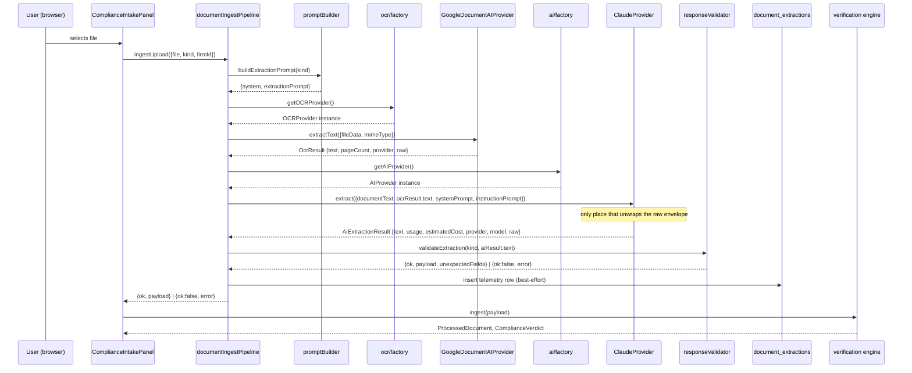

# BrokerMindAI — System Architecture

This document describes the production architecture of the BrokerMindAI underwriting workspace, with a focus on the AI document ingestion pipeline introduced in Phase 1 and the provider abstraction layer introduced in Phase 1.5. See `docs/ROADMAP.md` for what's shipped versus planned.

**Before implementing any change described or implied by this document, see
`docs/ENGINEERING_STANDARDS.md`** — it defines the mandatory lifecycle (Architecture →
Implementation → Build → Infrastructure → Deployment → Production Verified) every feature must
pass through, and the infrastructure audit that must run before code is written.

## 1. Overall system architecture

```mermaid
flowchart TD
    subgraph client["Browser (TanStack Start SPA)"]
        UI["ComplianceIntakePanel /\nDashboard routes"]
        Store["Client state\n(verificationStore, applicationStore, ...)"]
    end

    subgraph supabase["Supabase (shared with Launchpad — kwdusucahpkfomjiyhie)"]
        Auth["Supabase Auth\n(session, 2FA planned)"]
        DB[("Postgres\nfirms / underwriting_applications /\ndocument_extractions / audit_logs / ...")]
        EdgeFns["Edge Functions\nocr-proxy, ai-proxy, flinks-proxy, plaid-proxy"]
    end

    subgraph external["External AI providers (behind the provider abstraction — §9)"]
        DocAI["Google Document AI\n(only implemented OCR provider)"]
        Claude["Anthropic Claude\n(only implemented AI provider)"]
    end

    UI -->|session| Auth
    UI -->|CRUD, RLS-scoped| DB
    UI -->|documentIngestPipeline via\ngetOCRProvider()/getAIProvider()| EdgeFns
    EdgeFns --> DocAI
    EdgeFns --> Claude
    EdgeFns -->|telemetry write-back happens client-side| DB
    UI --> Store
```

This app and the Launchpad marketing/waitlist site are **separate git repos and separate Vercel projects**, but **share one Supabase project** (`kwdusucahpkfomjiyhie`). Schema changes here are shared infrastructure.

Data model is organized around **firms** (`firms` / `firm_members` / `is_firm_member(firm_id)`), this app's existing workspace/organization concept — every table that should be workspace-scoped (applications, documents, audit logs, and now extraction telemetry) carries a `firm_id`.

## 2. AI document ingestion pipeline

```
Upload (PDF / JPG / JPEG / PNG / HEIC / HEIF / TIFF / WebP, or a .json test file)
   │
   ▼
ComplianceIntakePanel.onFile()
   │  (thin — delegates entirely to the pipeline)
   ▼
documentIngestPipeline.ingestUpload()
   │
   ├─ isJsonFile? ──yes──► ingestFromJson()  [TEMPORARY, see §6]
   │                          reads the file as JSON verbatim, no OCR/AI provider
   │
   └─ no ──► ingestFromDocument()
                 │
                 ├─ resolveEffectiveMimeType() against DocumentIngestionDefinition.upload
                 │     (MIME check with a filename-extension fallback — HEIC/HEIF often
                 │      report an empty file.type in non-Apple browsers)
                 ├─ buildExtractionPrompt(kind)      [documentDefinitions/promptBuilder.ts]
                 ├─ getOCRProvider().extractText()   [src/providers/ocr — Phase 1.5]
                 │     → whichever OCR provider VITE_OCR_PROVIDER resolves to
                 │       (only google-document-ai implemented; wraps ocr-proxy)
                 ├─ getAIProvider().extract()        [src/providers/ai — Phase 1.5]
                 │     → whichever AI provider VITE_AI_PROVIDER resolves to
                 │       (only claude implemented; wraps ai-proxy)
                 │       receives ONLY plain OCR text — never knows which OCR
                 │       provider produced it
                 ├─ validateExtraction(kind, aiResult.text) [documentDefinitions/responseValidator.ts]
                 │     strips markdown fences, JSON.parse, allowlists keys against
                 │     DocumentRegistry[kind].fields[].name — takes a normalized
                 │     string, has no provider-specific knowledge at all
                 └─ recordExtraction()  → document_extractions (telemetry, best-effort)
   │
   ▼
ingest(payload)   [ComplianceIntakePanel.tsx — UNCHANGED]
   │
   ▼
processDocument() → aggregateCompliance()   [documentRegistry.ts — UNCHANGED]
   │
   ▼
verificationStore.addDoc()                  [UNCHANGED]
   │
   ▼
DocumentVerificationModal / DossierGate / ComplianceAlertBanner / ...  [ALL UNCHANGED]
```

**The verification engine has zero knowledge that OCR or AI providers exist at all.** Its only contract with the pipeline is the plain `Record<string, unknown>` payload `ingest()` receives — the same shape whether it came from manual form entry, a JSON test file, or a real scanned document, regardless of which OCR/AI providers processed it.

### Files

| File | Role |
|---|---|
| `src/lib/documentIngestPipeline.ts` | Owns the entire flow: type detection, base64 conversion, prompt building, calling the provider abstraction, response validation, telemetry. Depends only on `getOCRProvider()`/`getAIProvider()` — never a concrete provider class. |
| `src/documentDefinitions/types.ts` | `DocumentIngestionDefinition` type — upload/OCR/AI config only, referencing the canonical `OcrProviderId`/`AiProviderId` types (§9). |
| `src/documentDefinitions/registry.ts` | `getIngestionDefinition(kind)` — per-kind overrides with sensible defaults, so any `DocumentKind` already in `documentRegistry.ts` works without a new entry here. |
| `src/documentDefinitions/promptBuilder.ts` | Generates the AI provider's system prompt + extraction instruction from `DocumentRegistry[kind].fields` — no hand-written per-document prompt text anywhere, no provider-specific knowledge. |
| `src/documentDefinitions/responseValidator.ts` | Cleans/validates the AI provider's normalized text response, aligning field names exactly with `DocumentRegistry[kind].fields[].name`. Provider-agnostic — never sees a raw provider envelope. |
| `src/providers/ocr/*`, `src/providers/ai/*` | The provider abstraction layer — see §9. |
| `src/lib/proxyClient.ts` | **Unchanged.** `ocrProxy`, `aiProxy` still wrap the edge functions; the pipeline no longer calls `extractDocument()` directly (superseded by the provider classes, which call `ocrProxy`/`aiProxy` individually) but the file itself wasn't modified. |
| `supabase/functions/ocr-proxy`, `ai-proxy` | **Unchanged.** Real Google Document AI / Anthropic calls, gated by vault secrets. |

## 3. Verification engine (unchanged, preserved as-is)

- `src/utils/documentRegistry.ts` — `DocumentRegistry` (per-`DocumentKind` fields/extract/validate), `processDocument()`, `aggregateCompliance()`, `runSuperPriorityChecks()`. This is the compliance/risk engine and remains the single source of truth for **what fields a document has** and **how they're validated**.
- `src/store/verificationStore.ts` — in-memory (zustand) per-field confidence + document status lifecycle (`uploaded → pending → review → verified`).
- `src/components/DocumentVerificationModal.tsx` — human-in-the-loop field review/correction/lock UI.
- `src/components/DossierGate.tsx` — terminal funding-readiness gate.

None of these were modified for Phase 1. They were not designed with AI extraction in mind, and they didn't need to be — the pipeline conforms to their existing contract rather than the other way around.

## 4. Document Registry — two registries, one job each

There are deliberately **two** registries, not one, to avoid a duplicated schema:

- **`documentRegistry.ts`** (pre-existing) — owns field names, labels, types, extraction aliasing, and compliance validation, per `DocumentKind`.
- **`documentDefinitions/`** (new, Phase 1) — owns ingestion configuration only: accepted upload formats, OCR strategy/processor, Claude model/prompt overrides.

A document type's fields are defined exactly once. Enabling real AI extraction for a *new* `DocumentKind` that already exists in `documentRegistry.ts` requires **zero code changes** to the pipeline — `getIngestionDefinition()` falls back to sensible defaults for any kind without an explicit override.

## 5. Telemetry architecture

Every extraction — success or failure, real document or JSON test upload — writes exactly one row to `document_extractions`. Rows are **immutable**: a future replay creates a new row sharing the same `document_id`, it never overwrites the original. No `UPDATE`/`DELETE` RLS policies exist on this table by design.

Recorded per extraction: firm/application/document identity, document kind, definition/prompt version, OCR/LLM provider+model, raw OCR text, raw Claude response, structured JSON, validation outcome, start/end timestamps + latency, token usage, an estimated cost (rough, telemetry-only — **not a billing figure**), success/failure, and error detail. Scoped by `firm_id` per the existing workspace model.

This exists *now*, with no UI to view it, because it is the load-bearing prerequisite for the Reserved Internal Tools phase (§6) — replay, raw-response viewers, and cost/latency dashboards are all impossible to backfill retroactively; the only time to start capturing this is before it's needed.

**Note on the temporary JSON upload path:** `ingestFromJson()` also writes telemetry (with `ocr_provider`/`llm_provider` null and `source: "json-upload"`), so its usage is auditable and it isolates cleanly behind the same reporting surface once Internal Tools exists.

## 6. Future Internal Tools architecture (reserved, not built)

Internal Tools is a permanent architectural commitment, not a backlog item — see the Reserved Phase in `docs/ROADMAP.md`. Design constraints locked in now:

- **Location:** same app, a separate route subtree (`src/routes/internal/*`), code-split, never linked from customer-facing navigation.
- **Access control:** a new `SuperAdminGate` (composes the existing `AuthGate` with a role check) — reachable only by direct URL and only rendered for the correct role. Any new edge functions Internal Tools introduces must independently verify the role server-side too (extending `_shared/proxy.ts`'s `guard()`), not rely on client-side gating alone.
- **Planned surface:** JSON upload (promoted from its current temporary spot), OCR replay, raw OCR/Claude response viewers, confidence heatmap, force reprocess, prompt-version comparison, AI latency / token usage / estimated cost dashboards, OCR/LLM provider config, feature flags, pipeline diagnostics.
- **Data dependency:** reads `document_extractions` (§5) and the Document Definition Registry (§4). Never calls `ingest()` or mutates a real applicant's verification data directly.

## 7. Authentication architecture (present today)

Contrary to how "Phase 2: Authentication" might read as unstarted, real infrastructure already exists:

- `src/hooks/useUser.tsx` — `UserProvider`, real Supabase Auth session (`getSession`/`onAuthStateChange`), 15-minute inactivity timeout with a warning modal, audit-logged login/logout.
- `src/components/AuthGate.tsx` — session gate wrapping every substantive route (`index`, `dashboard`, `compliance`, `lender`, `pipeline`, `renewals`, `settings`).
- `src/hooks/useUserRole.ts` — queries `user_roles` for a boolean `isAdmin` today.
- `src/components/AuditLogViewer.tsx` — already gated by `isAdmin`, rendered in `/settings`; the closest existing prototype of what Internal Tools becomes.
- `src/lib/auditLog.ts` — writes to `audit_logs` (LOGIN/LOGOUT/VERIFY/OVERRIDE already wired in).

What's missing, and scoped to Phase 2: a real role **hierarchy** (today there is only one boolean tier) and 2FA.

## 8. Planned RBAC

| Role | Scope | Represents |
|---|---|---|
| Customer | Tenant (firm) | A broker/brokerage using BrokerMindAI day to day |
| Processor | Tenant (firm) | Staff handling file intake — narrower CRUD than Customer/Admin |
| Admin | Tenant (firm) | Org-level admin — manages their own firm's users/billing/settings |
| Super Admin | Platform-wide | BrokerMindAI's own engineering/operations staff — the only role with Internal Tools access |

Customer/Processor/Admin are tenant-side roles scoped by `firm_id`; Super Admin is a platform-side role, not tenant-scoped. Implementation: extend `user_roles.role` from its current boolean-admin usage to an enum (`customer | processor | admin | super_admin`), and extend `useUserRole()` additively (`{ role, isAdmin, isSuperAdmin, isProcessor, loading }`) so `AuditLogViewer`'s existing `isAdmin` check keeps working unchanged.

## 9. Provider abstraction (implemented, Phase 1.5; Gemini AI added Phase 1.6; Gemini OCR added Phase 1.8)

The pipeline depends only on two interfaces — `OCRProvider` and `AIProvider` — never on a concrete provider class. Two OCR implementations (Google Document AI, Gemini) and two AI implementations (Claude, Gemini) exist today; everything else is a recognized-but-unimplemented identifier, not new API integration.

```
src/providers/
  ocr/
    types.ts                     OCRProvider, OcrRequest, OcrResult, OcrProviderId
    googleDocumentAIProvider.ts   wraps ocr-proxy
    geminiOcrProvider.ts          wraps gemini-proxy with an OCR-only system prompt — Phase 1.8
    factory.ts                    getOCRProvider() — reads VITE_OCR_PROVIDER
  ai/
    types.ts                     AIProvider, AiExtractionRequest, AiExtractionResult, AiProviderId
    claudeProvider.ts             wraps ai-proxy
    geminiProvider.ts              wraps gemini-proxy — Phase 1.6, validates the full pipeline without Claude billing
    factory.ts                    getAIProvider() — reads VITE_AI_PROVIDER
```

**Configuration, not hardcoding.** `getOCRProvider()`/`getAIProvider()` each read a client-exposed env var and instantiate the matching class:

```
VITE_OCR_PROVIDER=google-document-ai   (default if unset; gemini also available)
VITE_AI_PROVIDER=claude                (default if unset; gemini also available)
```

The `VITE_` prefix is required, not cosmetic — `documentIngestPipeline.ts` runs in the browser (it's called from `ComplianceIntakePanel`, a React component), and Vite only injects env vars prefixed `VITE_` into client-side `import.meta.env`; an unprefixed `AI_PROVIDER` would silently never reach this code. A bare `process.env.AI_PROVIDER` read, as a naive port of the example in the task that introduced this phase would suggest, simply wouldn't work here.

**Recognized-but-unimplemented providers.** Selecting one throws a clear, actionable error rather than silently falling back or doing nothing:

| Layer | Implemented | Recognized, not yet implemented |
|---|---|---|
| OCR (`OcrProviderId`) | `google-document-ai`, `gemini` | `azure-document-intelligence`, `aws-textract`, `tesseract`, `native-pdf-parser` |
| AI (`AiProviderId`) | `claude`, `gemini` | `openai`, `azure-openai`, `aws-bedrock`, `vertex-ai` |

**Gemini AI specifics (`ai/geminiProvider.ts`):** wraps the `gemini-proxy` edge function (`supabase/functions/gemini-proxy`, vault secret `GEMINI_API_KEY`) calling `gemini-flash-latest` by default. Owns its own response-envelope unwrapping (`candidates[0].content.parts[].text`), usage-metadata mapping (`usageMetadata.promptTokenCount`/`candidatesTokenCount`), and per-token cost estimate. Adding it required zero changes to `documentIngestPipeline.ts`, `responseValidator.ts`, or any protected verification component — only a new provider file, a new edge function, and one addition to `factory.ts`, exactly per the pattern below.

**Gemini OCR specifics (`ocr/geminiOcrProvider.ts`, Phase 1.8):** exists so `pipeline` mode (OCR stage → AI stage, both independent — see below) works with only `GEMINI_API_KEY` configured, no `GOOGLE_DOCUMENT_AI_KEY`. Calls the *same* `gemini-proxy` edge function as `ai/geminiProvider.ts` — it's the same underlying Gemini API — but with a distinct system prompt instructing Gemini to act as a plain OCR engine (verbatim transcription only, explicitly told not to interpret, correct, or extract fields) and its own, separate response parsing. This is deliberate: OCR and AI stay two independent calls with independent prompts and telemetry — Gemini running both stages is a configuration choice, not a merge of the two roles into one call. That distinction is what `native` mode (below) intentionally gives up in exchange for a single round-trip; `pipeline` mode with `VITE_OCR_PROVIDER=gemini` keeps both stages while avoiding the Google Document AI dependency.

**Ingestion mode — pipeline vs. native (`VITE_INGESTION_MODE`, Phase 1.7):** `AiExtractionRequest` carries either `documentText` (OCR output) or `fileData`/`mimeType` (the raw file), never both — which one depends on `documentIngestPipeline.ts`'s ingestion mode, not on which AI provider is selected:

| Mode | Flow | When |
|---|---|---|
| `pipeline` (default, unset) | OCR provider → AI provider, `documentText` only | Standard path — cost-optimized (raw files never reach the LLM), and the only mode that works when the selected AI provider doesn't support native documents |
| `native` | AI provider reads the raw file directly (`fileData`/`mimeType`), OCR provider never called | AI provider's `supportsNativeDocument` must be `true` (Claude and Gemini both are — Claude via `ai-proxy`'s pre-existing `image_base64`/`image_mime` fields, Gemini via `gemini-proxy`'s `inline_data` part) — otherwise `documentIngestPipeline.ts` throws a clear, actionable error rather than silently falling back to `pipeline` |

`native` mode exists so Google Document AI (OCR) is not a hard dependency for every AI provider — e.g. testing with only `GEMINI_API_KEY` configured, no `GOOGLE_DOCUMENT_AI_KEY`. Telemetry distinguishes it: `document_extractions.source = "native-upload"` (vs. `"upload"` for pipeline mode), `ocr_provider`/`ocr_model` both `null`. No migration was needed for the new `source` value — it's an unconstrained `text` column (see `docs/BACKEND_SCHEMA.md`).

**The boundary that matters:** the AI layer never receives an OCR provider's raw response shape, and `responseValidator.ts` never receives an AI provider's raw response envelope — each provider class normalizes its own output (e.g. `ClaudeProvider`/`GeminiProvider` are the only places their respective response envelopes are unwrapped) before handing a plain value to the next layer, in either ingestion mode. This is what makes adding a provider additive:

- **Add an OCR provider:** new file in `src/providers/ocr/`, implement `OCRProvider`, wire it into `factory.ts`. Nothing else changes.
- **Add an AI provider:** new file in `src/providers/ai/`, implement `AIProvider` (including that provider's own cost-estimate formula — see `ClaudeProvider`), wire it into `factory.ts`. Nothing else changes — not `documentIngestPipeline.ts`, not `responseValidator.ts`, not `promptBuilder.ts`.
- Neither touches `documentRegistry.ts`, `verificationStore.ts`, `DocumentVerificationModal.tsx`, or `DossierGate.tsx`.

**Per-document-kind provider config vs. runtime selection.** `DocumentIngestionDefinition.ocr.provider`/`.ai.provider` (§4) are descriptive metadata — which provider a document kind is *configured* to expect — not what actually runs. The factories' env-driven selection is the single source of truth for instantiation. Telemetry always records the *actual* provider identity returned by the provider instance (`ocrResult.provider`/`aiResult.provider`), not the static config value, so it stays accurate even if they ever diverge.

The billing/usage model (per `document_extractions`' schema) is also provider-agnostic by construction: usage is computed from successful processing records (kind, provider, tokens, cost), not from a provider-specific credit system — swapping providers doesn't touch reporting.

## 10. Data flow: a single extraction, end to end


